<!-- ═══════════════════ HEADER ═══════════════════ -->
<div align="center">


<!-- Typing animation -->
<a href="https://github.com/jorgeale90">
  
</a>

<br/><br/>

<!-- Animated Mario runner (commit assets/mario-run.svg to your repo) -->


<br/><br/>

<!-- Badges -->
<a href="https://linkedin.com/in/jorge-cruz-borges"></a>
<a href="mailto:jorgealec90@gmail.com"></a>


</div>

<!-- ═══════════════════ ABOUT ═══════════════════ -->

## 🍄 World 1-1 · About Me

```text
▓▓▓▓▓▓▓▓▓▓▓▓▓▓▓▓▓▓▓▓▓▓▓▓▓▓▓▓▓▓▓▓▓  PLAYER: JORGE  ▓▓▓▓▓▓▓▓▓▓▓▓▓▓▓▓▓▓▓▓▓▓▓▓▓▓▓▓▓▓▓▓▓
 LEVEL: 10+ years XP        CLASS: Full-Stack Developer        BASE: Sharjah, UAE 🇦🇪
 QUEST: Remote & relocation opportunities in Europe 🇪🇺
▓▓▓▓▓▓▓▓▓▓▓▓▓▓▓▓▓▓▓▓▓▓▓▓▓▓▓▓▓▓▓▓▓▓▓▓▓▓▓▓▓▓▓▓▓▓▓▓▓▓▓▓▓▓▓▓▓▓▓▓▓▓▓▓▓▓▓▓▓▓▓▓▓▓▓▓▓▓▓▓▓▓
```

- 🏰 **10+ years** building production web apps for **critical-sector clients** — fire department management, public health, and government systems
- ⭐ Currently a **Full-Stack Developer @ FirstDue (FDSU)** — fire department platform used by US agencies: PHP backend, Vue.js frontend, RabbitMQ queues & geospatial layers
- 🔥 Architected a full **audit trail system** with RabbitMQ/AMQP consumers — solved race conditions between async queues and PostgreSQL, eliminating FK violations in production
- 🗺️ Hands-on with **geospatial systems**: ArcGIS Maps SDK & Google Maps API
- 🧪 Testing believer: **PHPUnit** (backend) + **Playwright** (E2E)
- 🗣️ Spanish (native) · English (professional) · Italian (B1/B2)

<!-- ═══════════════════ TECH STACK ═══════════════════ -->

## ⭐ Power-Ups · Tech Stack

<div align="center">

### 🔧 Backend


### 🎨 Frontend


### 🗄️ Databases & Queues


### 🚀 Infrastructure & Tools


</div>

<details>
<summary>🎮 <b>Full inventory (click to expand)</b></summary>
<br/>

| Category | Skills |
|---|---|
| **Backend** | PHP 7/8 · Symfony 4/5/6 · Laravel · Yii 1.x · RESTful API Design · PHPUnit |
| **Frontend** | Vue.js 2/3 · Vuex · Pinia · JavaScript ES6+ · TypeScript · HTML5/CSS3 · Twig · Playwright |
| **Databases** | PostgreSQL · MySQL · SQLite · Redis |
| **Geospatial** | ArcGIS Maps SDK · Google Maps API |
| **Infrastructure** | Docker · WSL2 · RabbitMQ/AMQP · Git · Supervisor · GNU Linux |
| **Process** | PHPStorm · Jira · Zoho · Agile/Scrum |

</details>

<!-- ═══════════════════ EXPERIENCE ═══════════════════ -->

## 🏰 Castle Log · Experience

| 🕹️ Level | Role | Where | When |
|---|---|---|---|
| 🌋 **World 8** | Full-Stack Developer | **FirstDue (FDSU)** — US fire dept. platform | 2023 → Present |
| 🏝️ **World 4** | Freelance Full-Stack Dev | 4 production systems (Symfony 4–6 + Vue) — CLIO, Sabio, MenuTo-Go, Digital Finance | 2018 → 2023 |
| 🏯 **World 1** | System Engineer | Ministry of Information of Cuba — cryptographic systems | 2014 → 2018 |

🎓 **Computer Engineering, B.Sc.** — Universidad de Oriente (2009–2014)

<!-- ═══════════════════ STATS ═══════════════════ -->

## 📊 High Scores · GitHub Stats

<div align="center">


<br/><br/>


<br/><br/>


</div>

<!-- ═══════════════════ FOOTER ═══════════════════ -->

<div align="center">

### 🏁 Thanks for playing!

**Let's talk:** [jorgealec90@gmail.com](mailto:jorgealec90@gmail.com)


</div>
